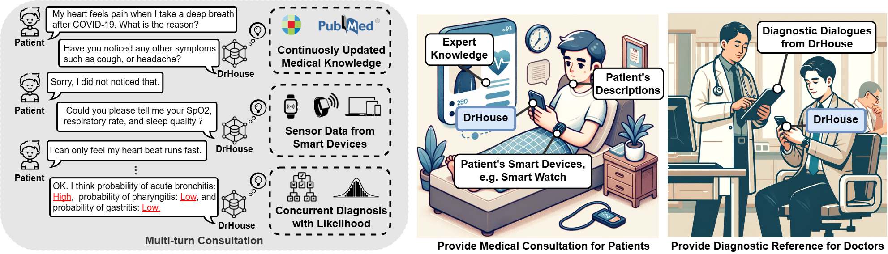

<p align="center">
  <h1 align="center"><strong>DrHouse: LLM-Empowered Diagnostic Reasoning with Sensor Data and Expert Knowledge</strong></h1>
  <p align="center">
    <a href='https://scholar.google.com/citations?user=q_KcYaQAAAAJ&hl=zh-CN' target='_blank'>Bufang Yang†
</a>&emsp;
    <a href='http://syjiang.com/' target='_blank'>Siyang Jiang†
</a>&emsp;
    <a href='https://initxu.github.io/' target='_blank'>Lilin Xu</a>&emsp;
    <a href='https://www.linkedin.com/in/kaiwei-liu-743567219/?originalSubdomain=hk' target='_blank'>Kaiwei Liu</a>&emsp;
    <a target='_blank'>Hai Li</a>&emsp;
    <a href='https://staff.ie.cuhk.edu.hk/~glxing/' target='_blank'>Guoliang Xing</a>&emsp;
    <a href='https://www.ie.cuhk.edu.hk/faculty/chen-hongkai/' target='_blank'>Hongkai Chen</a>&emsp;
    <a href='http://fredjiang.com/' target='_blank'>Xiaofan Jiang</a>&emsp;
    <a href='https://yanzhenyu.com/' target='_blank'>Zhenyu Yan‡</a>&emsp;
    <br>
    The Chinese University of Hong Kong&emsp;Columbia University
  </p>
</p>

## 🏠 About

<div align="center">
  
</div>

We introduce DrHouse, a novel LLM-based multi-turn consultation virtual doctor system, which incorporates three significant contributions: 1) It utilizes sensor data from smart devices in the diagnosis process, enhancing accuracy and reliability. 2) DrHouse leverages continuously updating medical knowledge bases to ensure its model remains at diagnostic standard’s forefront. 3) DrHouse introduces a novel diagnostic algorithm that concurrently evaluates potential diseases and their likelihood, facilitating more nuanced and informed medical assessments. Through multi-turn interactions, DrHouse determines the next steps, such as accessing daily data from smart devices or requesting in-lab tests, and progressively refines its diagnoses.

## Project Structure
```
DrHouse/
├─ checkpoints/
├─ data/
│  ├─ adaptive_retrieval_dataset/
│  ├─ guideline_trees/
│  ├─ medical_database_chroma/
│  ├─ medical_dialogues/
│  ├─ medical_sources/
│  ├─ Symptom2Disease/
├─ exp_real/
│  ├─ data/
│  ├─ results/
│  ├─ create_sensordata_vector_db.py
├─ exp_simulation/
│  ├─ data/
│  ├─ results/
│  ├─ create_sensordata_vector_db.py
├─ figs/
├─ prompt/
├─ src/
│  ├─ adaptive_retrieval/
│  ├─ baselines/
│  ├─ code_generation/
│  ├─ guideline_tree_retrieval/
│  ├─ simulation/
│  ├─ create_medical_database.py
│  ├─ eval_dialogues.py
│  ├─ main.py
│  ├─ semantic_filter.py
│  ├─ utils.py
├─ .gitignore
├─ environment.yml
├─ README.md
├─ requirements.txt
```

## Installation

1. **Clone the repository:**
```bash
git clone https://github.com/bf-yang/DrHouse.git
cd DrHouse
```

2. **Install packages:**
```bash
conda env create -f environment.yml
conda activate drhouse
```

## Usage

### Setup

**Create the medical database:**
```bash
python src/create_medical_database.py
```

**Train semantic filter:**
```bash
python src/semantic_filter.py
```

### Consultation

**Real-world data consultation:**
```bash
python src/main.py --exp real --user_name cj_t2
```

**Simulation data consultation:**
- Two-agent consultation: `python src/simulation/simulation_consultation.py`
- Real person interactions: `python src/main.py --exp simulation --user_name sim_data_ab_1`

### Evaluation

```bash
python src/eval_dialogues.py
```

### User Interfaces

**Web UI:**
```bash
python src/mainWebUI.py
```

**Android UI:**
1. Start the server: `python src/mainAndroidUIServer.py`
2. Run the Android app: `Interaction-Speak-Sockets-Android`


## Citation

If you find our work helpful, please consider citing:

```bibtex
@article{yang2024drhouse,
  title={DrHouse: An LLM-empowered diagnostic reasoning system through harnessing outcomes from sensor data and expert knowledge},
  author={Yang, Bufang and Jiang, Siyang and Xu, Lilin and Liu, Kaiwei and Li, Hai and Xing, Guoliang and Chen, Hongkai and Jiang, Xiaofan and Yan, Zhenyu},
  journal={Proceedings of the ACM on Interactive, Mobile, Wearable and Ubiquitous Technologies},
  volume={8},
  number={4},
  pages={1--29},
  year={2024},
  publisher={ACM New York, NY, USA}
}
```
